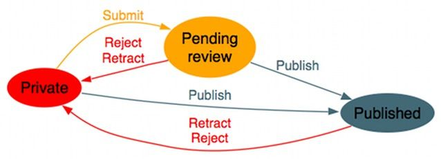

Meta-Programming
================

Motivation
----------

Last week we developed the interface for a state-machine based ``Workflow``
class that allows implementing simple workflows like this classical
publishing example:

This was how we specified the workflow graph::

    class PublicationWorkflow(Workflow):
        
        def setup(self):
            """called by Workflow.__init__"""
            self.add_state('private', initial = True)
            self.add_state('review')
            self.add_state('published')

            self.add_transition('private', 'review', 'submit')
            self.add_transition('private', 'published', 'publish')
            self.add_transition('review', 'published', 'publish')
            self.add_transition('review', 'private', 'retract')
            self.add_transition('published', 'private', 'retract')

It is supposed to be used as adapter::

    class Article: pass

    a = Article()

    # adapts to any object
    PublicationWorkflow(a).transition_to("published")

While this adapter usage of the Workflow classes is as we wanted it to be,
the definition of ``PublicationWorkflow`` is quite bloated.
Also, ``setup()`` is run upon every instantiation of a Workflow.
Besides the performance overhead, this also means that any checks we want to
do on the workflow graph are delayed until then.

To improve on that, we want to write this::

    class PublicationWorkflow(Workflow):
        initial = 'private'
        states = ('private', 'review', 'published')
        transitions = (
            ('private', 'review', 'submit'),
            ('private', 'published', 'publish'),
            ('review', 'published', 'publish'),
            ('review', 'private', 'retract'),
            ('published', 'private', 'retract'),
        )

and we want the sanity checks to run right at this point where we
define the class, not later when we instantiate it.

Metaclasses
-----------

Metaclasses are to classes what classes are to objects:

.. math::

    class : object \leftrightarrow metaclass : class

Or

    Metaclasses are the class of a class

    Metaclasses are factories for classes

``type`` is the built-in metaclass, lets see how it works::

    class Foo(object):
        bar = 1

    # is the same as

    Foo = type("Foo", (object,), {'bar': 1,})

So that whole ``class`` thing is really just syntactic sugar for 'evaluate the
class suite, throw the result into your metaclass, bind the result to the
provided name'.

We can hook in here with our own metaclass::

    class Foo(object):
        __metaclass__ = Meta
        bar = 1

    class Meta(type):

        def __new__(mklass, name, bases, namespace):
            return type.__new__(mklass, name, bases, namespace)

        def __init__(klass, name, bases, namespace):
            pass

``__new__`` is a class method and will be called first - because it returns the
new class it can also change the type and name, even return a completely 
different class (useful for singletons).
It can also add new items to the namespace or change the list of base classes.
``__init__`` is called later and restricted to modifying existing entries in
``namespace``.

If only ``__init__`` is required, a metafunction will do::

    def Meta(name, bases, namespace):
        ...

Use Cases
---------

Whenever we want to act on a class upon its creation, eg. for

 * Validating class data (eg. the Workflow transition checks mentioned above)
 * Provide more natural, declarative end-user interface (also Workflow, compare
   to our previous implementations)
 * Auto-decorating of methods
 * Auto-registration of classes

Most stuff can be implemented in other ways, too, but might result in less
clean APIs.

.. note::
  meta-methods and -properties are the only features exclusively
  available thru metaclass use.

Inheritance
-----------

``__metaclass__`` are inherited, but can be overwritten. Whatever happens, only
one metaclass is called.

Python 3
--------

No changes except for how you specify the metaclass::

    class Foo(metaclass=MyMetaClass):
        pass

``2to3`` catches ``__metaclass__`` attributes and does the conversion
automatically.

References
----------

In-depth presentation on metaclasses in 2.2:
http://www.vrplumber.com/programming/metaclasses.pdf

Guido's Blog post about the history of metaclasses:
http://python-history.blogspot.com/2009/04/metaclasses-and-extension-classes-aka.html

For the non-selfists, Michael Foord shows how to get rid of the canonical
``self`` as first parameter in instance method signatures:
http://www.voidspace.org.uk/python/articles/metaclasses.shtml
